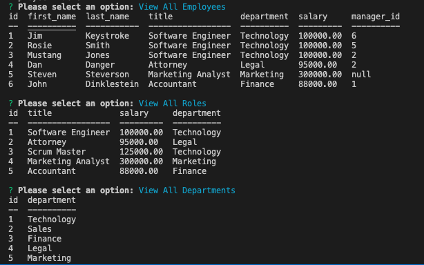

# Simple HRM
Simple HRM is a human resource management application. It allows for management of employees with management, department, role, and salary considerations. 

## Technologies
This application uses CLI to take user input. It uses Node.JS, Inquirer, Console.Table, dotenv, mysql2, and validator.

## Languages
Simple HRM is made using JavaScript and MySQL.

## Running the Application
- Clone the repository
- Install nodejs and the dependencies
- From mysql source the schema and seed the DB
- npm start to start the application

# [Walkthrough Video](https://drive.google.com/file/d/1uALtqVd0rkh_I_5_eT61j69PLcLl-dOf/view)

## Screenshot

### Contact

Simple HRM was made by [Dan Evola](https://dmevola.github.io/portfolio)